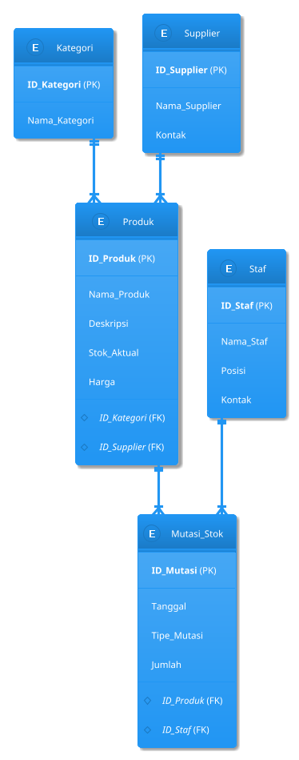

# Project Akhir - Sistem Manajemen Inventaris

Ini adalah proyek basis data yang dirancang untuk membangun fondasi sebuah Sistem Manajemen Inventaris. Sistem ini bertujuan untuk menyediakan struktur data yang terpusat dan efisien untuk melacak produk, mengelola stok, dan memonitor data terkait seperti pemasok dan kategori.

---

## Deskripsi Proyek

Sistem Manajemen Inventaris ini dirancang sebagai solusi backend untuk aplikasi yang membutuhkan pengelolaan stok yang akurat. Basis data ini memungkinkan pencatatan setiap pergerakan barang, mulai dari penerimaan dari pemasok hingga pengeluaran untuk penjualan atau penggunaan internal. Dengan struktur yang terdefinisi dengan baik, sistem ini dapat membantu mengurangi kesalahan, mengoptimalkan ketersediaan produk, dan menyediakan data yang andal untuk analisis bisnis.

## Fitur Utama

Berdasarkan skema database yang ada, sistem ini mendukung fungsionalitas berikut:

* **Manajemen Produk:** Menambah, melihat, dan mengelola detail setiap produk, termasuk nama, deskripsi, dan harga.
* **Kategorisasi Produk:** Mengelompokkan produk ke dalam kategori yang relevan untuk mempermudah pencarian dan pelaporan.
* **Manajemen Pemasok (Supplier):** Menyimpan dan mengelola informasi mengenai pemasok barang.
* **Manajemen Staf:** Mencatat data staf yang memiliki akses atau tanggung jawab terhadap pengelolaan inventaris.
* **Pelacakan Mutasi Stok:** Mencatat setiap transaksi yang memengaruhi jumlah stok (barang masuk, keluar, atau penyesuaian) secara detail, termasuk waktu dan staf yang bertanggung jawab.

---

## Struktur Database

Struktur basis data adalah inti dari sistem ini, yang terdiri dari lima tabel utama yang saling berhubungan.

### Diagram Skema Relasional

Diagram berikut memvisualisasikan hubungan antar tabel dalam sistem. (Catatan: GitHub tidak secara native merender PlantUML, Anda mungkin perlu menggunakan plugin atau menyimpannya sebagai gambar).



### Skema Relasional

* **Kategori** (**ID_Kategori**, Nama_Kategori)
* **Supplier** (**ID_Supplier**, Nama_Supplier, Kontak)
* **Staf** (**ID_Staf**, Nama_Staf, Posisi, Kontak)
* **Produk** (**ID_Produk**, Nama_Produk, Deskripsi, Stok_Aktual, Harga, *ID_Kategori*, *ID_Supplier*)
* **Mutasi_Stok** (**ID_Mutasi**, Tanggal, Tipe_Mutasi, Jumlah, *ID_Produk*, *ID_Staf*)

---

## Setup Database

Untuk menggunakan skema ini, jalankan skrip SQL berikut pada sistem manajemen basis data Anda (misalnya, SQL Server, MySQL, PostgreSQL).

```sql
-- Membuat Tabel Kategori
CREATE TABLE Kategori (
    ID_Kategori NVARCHAR(50) PRIMARY KEY,
    Nama_Kategori NVARCHAR(100) NOT NULL
);

-- Membuat Tabel Supplier
CREATE TABLE Supplier (
    ID_Supplier NVARCHAR(50) PRIMARY KEY,
    Nama_Supplier NVARCHAR(150) NOT NULL,
    Kontak NVARCHAR(100)
);

-- Membuat Tabel Staf
CREATE TABLE Staf (
    ID_Staf NVARCHAR(50) PRIMARY KEY,
    Nama_Staf NVARCHAR(150) NOT NULL,
    Posisi NVARCHAR(50),
    Kontak NVARCHAR(100)
);

-- Membuat Tabel Produk
CREATE TABLE Produk (
    ID_Produk NVARCHAR(50) PRIMARY KEY,
    Nama_Produk NVARCHAR(200) NOT NULL,
    Deskripsi NVARCHAR(MAX),
    Stok_Aktual INT NOT NULL,
    Harga INT,
    ID_Kategori NVARCHAR(50),
    ID_Supplier NVARCHAR(50),
    FOREIGN KEY (ID_Kategori) REFERENCES Kategori(ID_Kategori),
    FOREIGN KEY (ID_Supplier) REFERENCES Supplier(ID_Supplier)
);

-- Membuat Tabel Mutasi_Stok
CREATE TABLE Mutasi_Stok (
    ID_Mutasi NVARCHAR(50) PRIMARY KEY,
    Tanggal DATETIME NOT NULL,
    Tipe_Mutasi NVARCHAR(20) NOT NULL,
    Jumlah INT NOT NULL,
    ID_Produk NVARCHAR(50),
    ID_Staf NVARCHAR(50),
    FOREIGN KEY (ID_Produk) REFERENCES Produk(ID_Produk),
    FOREIGN KEY (ID_Staf) REFERENCES Staf(ID_Staf)
);
```

---

## Potensi Pengembangan

Sistem ini memiliki potensi besar untuk dikembangkan lebih lanjut, antara lain:

- **Manajemen Pesanan:** Menambahkan modul *Purchase Order* dan *Sales Order*.
- **Laporan Analitik:** Membuat fitur untuk laporan stok minimum, produk terlaris, dan perputaran inventaris.
- **Integrasi Barcode/QR Code:** Menghubungkan sistem dengan pemindai untuk otomatisasi input data.
